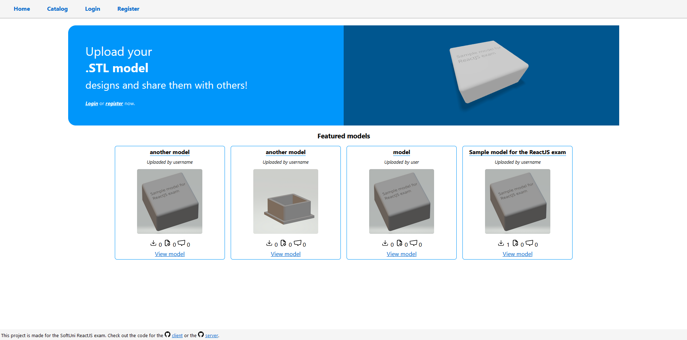

## About the project

3D Print Models is an application made for the SoftUni ReactJS exam. Its purpose is to provide the users a portal to upload their STL models that other users can view, download, like and comment.

## Non logged-in part

This is the part of the application that is accessible to all users.

- Home page
  

  - This is the landing page of the application. It contains a basic welcome banner that has a simple slogan on the left side and dynamic links below it. Non-registered users see links for the login and register pages.

  - Featured models are located just below the welcome banner. It contains the most recent 4 featured models.

- Catalog page
  

  - Search bar
    - The search bar provides the users to search a model by its name.
  - Model list
    - This is where the users can see all uploaded models, displayed as model cards, containing the model name, creator, image, downloads, likes, comments, as well as a link to the model page.

- Login page

  - This is where the users can log in to their accounts. If a user does not have an account yet, he can use the link below the log in button to get to the register page.

- Register page

  - The register page provides a form which anyone can use to register their account.

- Single model page
  

  - This is where the user can view all the models' details. The users can download the model from here, view the model in 3D if they choose so, or can visit the model creator's profile page.

- Profile page

  - The profile page provides a basic information about the user such as the uploaded models count, how many models did the user like and a list of his models.

## Logged-in part

Each logged in user can interact with the application in more ways than the guest user.

- Home page
  

  - Logged in users see a link to the models page on the left side of the welcome banner.

- Upload page

  - This is where the users can upload their models by providing a model name, description, the model file and some images.

- Single model page
  

  - In addition to downloading the model, logged in users can also add a like and a comment.
  - The model creator and admins can edit and delete the model.
  - Admins can also feature the model on the home page.

- Profile page
  
  - Users can change their email, image URL and password, using the link that only they can see in their profile page. Admins can change anyone's profile.

## Technology used

- [React](https://react.dev/)
- [React Router](https://reactrouter.com)
- [React STL Viewer](https://github.com/gabotechs/react-stl-viewer)
- [SVG Repo](https://www.svgrepo.com/)

## Scripts

```
npm run start
```

Runs the application in development mode on [localhost:3000](http://localhost:3000).

```
npm run build
```

Builds the application and places the bundle in the "build" folder. These are the files that are to be deployed on a web server.
